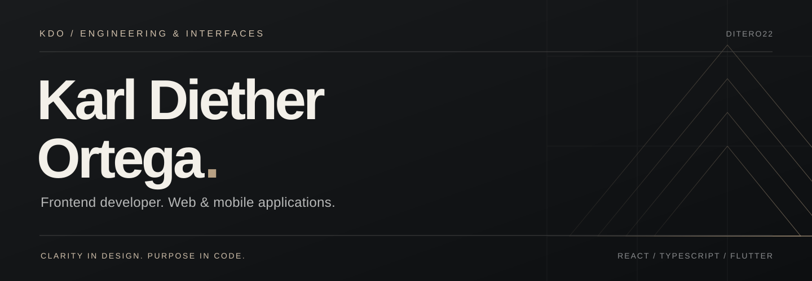

  <a href="#selected-work">Selected work</a> &nbsp; / &nbsp;
  <a href="#technical-toolkit">Technical toolkit</a> &nbsp; / &nbsp;
  <a href="https://github.com/Ditero22?tab=repositories">All repositories ↗</a>

 

## Profile

I'm **Karl Diether Ortega**, an Information Technology graduate building web and mobile applications. My interests span the interface, the data behind it, and the systems that connect them.

I work with **React, TypeScript, and Flutter**, with a growing focus on backend development using **Node.js and Supabase**. I enjoy turning practical problems into clear, usable software.

 

## Selected work

### 01 / BJOC — Real-Time Tracking

A real-time tracking and passenger information system spanning web and mobile applications.

**React · TypeScript · Flutter · Supabase · PostgreSQL**

[Explore the web repository ↗](https://github.com/Ditero22/BJOC-Web)

---

### 02 / Developer Portfolio

A personal portfolio presenting my projects, technical skills, and development work, with separate frontend and backend repositories.

**React · TypeScript · Vite · Tailwind CSS**

[Frontend ↗](https://github.com/Ditero22/Portfolio_frontend) &nbsp; / &nbsp; [Backend ↗](https://github.com/Ditero22/Portfolio_backend)

---

### Other projects

| Project | Focus | Technologies |
| :--- | :--- | :--- |
| **Dental Clinic Management** | Clinic management web application | React, TypeScript |
| **We Connect** | Mobile application development | Flutter, Dart, Figma |

 

## Technical toolkit

| Area | Technologies |
| :--- | :--- |
| **Frontend** | React, TypeScript, JavaScript, HTML, CSS, Tailwind CSS, Vite |
| **Mobile** | Flutter, Dart |
| **Backend & services** | Node.js, Express, Supabase, Firebase |
| **Databases** | PostgreSQL, MySQL, MongoDB |
| **Tools & workflow** | Git, GitHub, VS Code, Postman, Figma, Docker |

 

## Current direction

- **Interface development** — refining responsive layouts and reusable components with React and TypeScript.
- **Connected applications** — bringing interfaces, application logic, and persistent data together.
- **Backend foundations** — deepening my work with Node.js, databases, and Supabase.

 

---

<b>KARL DIETHER ORTEGA</b> &nbsp; / &nbsp; Frontend · Web · Mobile

[Browse my work on GitHub ↗](https://github.com/Ditero22?tab=repositories)
