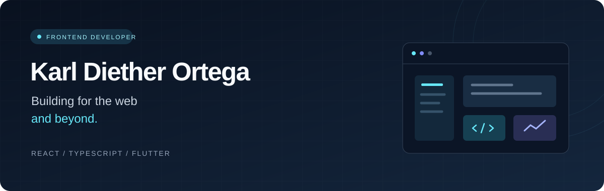

**Frontend development · Web applications · Mobile experiences**

I turn ideas into thoughtful interfaces and functional applications.

 

## A little about me

I'm **Karl Diether Ortega**, an Information Technology graduate focused on building modern, user-focused digital experiences. I enjoy connecting clean interfaces with the systems that make them work.

- **Building with** React, TypeScript, and Flutter.
- **Exploring** full-stack applications, backend systems, and cloud technologies.
- **Improving** my craft through practical projects and continuous learning.

 

## Selected work

<table>
<tr>
<td width="50%" valign="top">
<h3>01 &nbsp; BJOC Tracking</h3>

A real-time tracking and passenger information system, connecting web and mobile experiences.

REACT · TYPESCRIPT · FLUTTER · SUPABASE

<a href="https://github.com/Ditero22/BJOC-Web"><b>Explore the web project →</b></a>
</td>
<td width="50%" valign="top">
<h3>02 &nbsp; Developer Portfolio</h3>

A personal space to showcase my projects, technical skills, and development journey.

REACT · TYPESCRIPT · VITE · TAILWIND CSS

<a href="https://github.com/Ditero22/Portfolio_frontend"><b>Explore the frontend →</b></a>
 
<a href="https://github.com/Ditero22/Portfolio_backend">View the backend</a>
</td>
</tr>
<tr>
<td width="50%" valign="top">
<h3>03 &nbsp; Dental Clinic Management</h3>

A clinic management system project focused on a clear, practical web interface.

REACT · TYPESCRIPT

</td>
<td width="50%" valign="top">
<h3>04 &nbsp; We Connect</h3>

A mobile application project built with Flutter, exploring mobile development and interface design.

FLUTTER · DART · FIGMA

</td>
</tr>
</table>

 

## My toolkit

**Frontend**

**Mobile & backend**

**Data & development**

 

## What I'm focusing on

| Interface craft | Application development | Backend foundations |
| :--- | :--- | :--- |
| Building responsive interfaces with React and TypeScript. | Connecting web and mobile experiences to real data. | Developing with Node.js and Supabase. |

 

---

**Thoughtful interfaces. Practical applications. Always learning.**

[Explore my repositories](https://github.com/Ditero22?tab=repositories)

